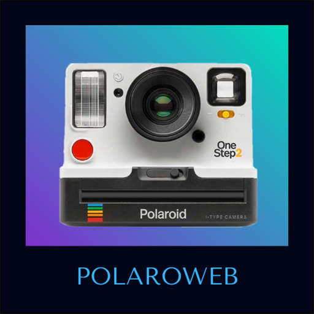

# 📸 PolaroWeb

<div align="center">
  
  <br/>
  <p><strong>Photobooth Online untuk Membuat Polaroid Digital Estetik</strong></p>
  <p>
    <a href="https://polaroweb.app">🌐 Live Demo</a> •
    <a href="#-fitur">✨ Fitur</a> •
    <a href="#-cara-menjalankan">🚀 Cara Menjalankan</a> •
    <a href="#-struktur-folder">📁 Struktur Folder</a>
  </p>
</div>

---

## 📝 Deskripsi

**PolaroWeb** adalah aplikasi photobooth berbasis web yang memungkinkan pengguna membuat foto polaroid digital dengan berbagai layout kreatif. Dibangun dengan teknologi modern seperti **React 19**, **Vite**, **TypeScript**, dan **Tailwind CSS v4**.

### 🎯 Tujuan Aplikasi

- Memberikan pengalaman photobooth digital yang mudah dan menarik
- Menyediakan berbagai pilihan layout polaroid (Classic, Strip, Photo Prints, Creative)
- Mendukung fitur PWA (Progressive Web App) agar dapat diakses offline dan diinstall di perangkat

---

## ✨ Fitur

### 📷 Mode Photobooth

| Mode | Deskripsi | Layout Tersedia |
|------|-----------|-----------------|
| **Classic Polaroid** | Foto instan dengan nuansa vintage yang ikonik | Square, Wide, Mini |
| **Strip Layout** | Cetakan foto dalam bentuk strip | 3 Strips, 4 Strips |
| **Photo Prints** | Cetakan foto standar berkualitas tinggi | 2R, 3R, 4R |
| **Creative Layouts** | Format inovatif untuk kreativitas | Snapshoot6, Snapshoot8 |

### 🎨 Fitur Lainnya

- **🎭 Background Picker** - Pilih background dari preset, warna solid, atau upload gambar sendiri
- **📱 PWA Support** - Install sebagai aplikasi dan gunakan secara offline
- **🖥️ Responsive Design** - Tampilan optimal di desktop dan mobile
- **⚡ Animasi Interaktif** - UI yang dinamis dengan GSAP dan Motion

---

## 🛠️ Teknologi yang Digunakan

| Teknologi | Versi | Fungsi |
|-----------|-------|--------|
| [React](https://react.dev) | 19.1.1 | Library UI utama |
| [Vite](https://vite.dev) | 7.1.2 | Build tool & dev server |
| [TypeScript](https://typescriptlang.org) | 5.8.3 | Type safety |
| [Tailwind CSS](https://tailwindcss.com) | 4.1.12 | Styling utility-first |
| [React Router](https://reactrouter.com) | 7.9.1 | Client-side routing |
| [GSAP](https://gsap.com) | 3.13.0 | Animasi kompleks |
| [Motion](https://motion.dev) | 12.23.16 | Animasi deklaratif |
| [Lucide React](https://lucide.dev) | 0.544.0 | Icon library |
| [Three.js](https://threejs.org) | 0.180.0 | 3D graphics |

---

## 🚀 Cara Menjalankan

### Prasyarat

Pastikan sudah terinstall:
- **Node.js** (versi 18 atau lebih tinggi)
- **pnpm** (disarankan) atau **npm**

### Langkah-langkah

#### 1. Clone Repository

```bash
git clone https://github.com/username/polaroweb.git
cd polaroweb
```

#### 2. Install Dependencies

```bash
# Menggunakan pnpm (disarankan)
pnpm install

# Atau menggunakan npm
npm install
```

#### 3. Jalankan Development Server

```bash
# Menggunakan pnpm
pnpm dev

# Atau menggunakan npm
npm run dev
```

Aplikasi akan berjalan di `http://localhost:5173`

#### 4. Build untuk Production

```bash
# Menggunakan pnpm
pnpm build

# Atau menggunakan npm
npm run build
```

#### 5. Preview Production Build

```bash
# Menggunakan pnpm
pnpm preview

# Atau menggunakan npm
npm run preview
```

> **Catatan:** Preview menggunakan HTTPS dengan sertifikat lokal dari folder `cert/`

---

## 📁 Struktur Folder

```
polaroweb/
├── 📄 index.html              # Entry point HTML dengan SEO & PWA config
├── 📄 package.json            # Konfigurasi project & dependencies
├── 📄 vite.config.ts          # Konfigurasi Vite dengan alias & HTTPS
├── 📄 tsconfig.json           # Konfigurasi TypeScript
├── 📄 eslint.config.js        # Konfigurasi ESLint
├── 📄 components.json         # Konfigurasi shadcn/ui
├── 📄 firebase.json           # Konfigurasi Firebase hosting
├── 📄 .firebaserc             # Firebase project config
│
├── 📁 src/                    # Source code utama
│   ├── 📄 main.tsx           # Entry point React dengan Router
│   ├── 📄 App.tsx            # Root component dengan routes
│   ├── 📄 App.css            # Styling untuk App
│   ├── 📄 index.css          # Global CSS dengan Tailwind
│   ├── 📄 vite-env.d.ts      # TypeScript declarations untuk Vite
│   │
│   ├── 📁 components/        # Komponen React
│   │   ├── 📁 layouts/       # Layout components
│   │   │   ├── 📄 Header.tsx          # Header dengan efek scroll
│   │   │   ├── 📄 Nav.tsx             # Navigasi utama
│   │   │   ├── 📄 ListNav.tsx         # Item navigasi
│   │   │   ├── 📄 Footer.tsx          # Footer component
│   │   │   ├── 📄 HeroSection.tsx     # Hero section halaman utama
│   │   │   ├── 📄 Designed.tsx        # Section pilihan layout
│   │   │   └── 📄 CardCustom.tsx      # Card custom component
│   │   │
│   │   ├── 📁 pages/         # Halaman aplikasi
│   │   │   ├── 📄 Beranda.tsx              # Halaman beranda
│   │   │   ├── 📄 CustomPage.tsx           # Halaman kategori
│   │   │   ├── 📄 ClassicPolaroidPage.tsx  # Mode Classic Polaroid
│   │   │   ├── 📄 StripLayoutPage.tsx      # Mode Strip Layout
│   │   │   ├── 📄 PhotoPrintsPage.tsx      # Mode Photo Prints
│   │   │   └── 📄 CreativeLayoutsPage.tsx  # Mode Creative Layouts
│   │   │
│   │   ├── 📁 ui/            # UI primitives (shadcn/ui)
│   │   │   └── 📄 button.tsx # Button component
│   │   │
│   │   ├── 📄 AnimatedContent.tsx  # Komponen animasi GSAP
│   │   ├── 📄 BackgroundPicker.tsx # Picker untuk background
│   │   ├── 📄 DotGrid.tsx          # Background interaktif dots
│   │   ├── 📄 FadeContent.tsx      # Animasi fade in
│   │   ├── 📄 PwaInstallButton.tsx # Tombol install PWA
│   │   ├── 📄 RotatingText.tsx     # Teks berputar animasi
│   │   ├── 📄 SEO.tsx              # Komponen SEO dengan Helmet
│   │   ├── 📄 Stack.tsx            # Stack cards animasi
│   │   ├── 📄 TargetCursor.tsx     # Custom cursor effect
│   │   ├── 📄 TextType.tsx         # Efek typing text
│   │   └── 📄 TItleForPage.tsx     # Title reusable component
│   │
│   ├── 📁 context/           # React Context
│   │   └── 📄 BackgroundContext.tsx # State global untuk background
│   │
│   ├── 📁 hooks/             # Custom React Hooks
│   │   ├── 📄 useCamera.ts        # Hook untuk akses kamera
│   │   └── 📄 usePwaPrompt.ts     # Hook untuk PWA install prompt
│   │
│   ├── 📁 lib/               # Library & data
│   │   ├── 📄 utils.ts            # Utility functions (cn, getLayoutFromType)
│   │   ├── 📄 data.d.tsx          # Data kategori polaroid
│   │   ├── 📄 data-background.tsx # Data preset background
│   │   └── 📄 seo.data.ts         # Data SEO untuk setiap halaman
│   │
│   ├── 📁 utils/             # Utility functions untuk photobooth
│   │   ├── 📄 ambil-foto.tsx      # Fungsi capture foto
│   │   ├── 📄 atur-layout.tsx     # Fungsi mengatur layout
│   │   ├── 📄 download-photo.tsx  # Fungsi download hasil
│   │   ├── 📄 mulai-kamera.tsx    # Fungsi memulai kamera
│   │   ├── 📄 photo-utils.tsx     # Utility foto lainnya
│   │   └── 📄 types-props.tsx     # TypeScript types
│   │
│   └── 📁 assets/            # Static assets (images, fonts)
│
├── 📁 public/                # Static public files
│   ├── 📄 manifest.webmanifest    # PWA manifest
│   ├── 📄 sw.js                   # Service Worker
│   ├── 📄 pwa-192x192.png         # PWA icon 192x192
│   ├── 📄 pwa-512x512.png         # PWA icon 512x512
│   ├── 📄 icon.jpeg               # Favicon
│   ├── 📁 image/                  # Gambar untuk hero section
│   └── 📁 background/             # Preset background images
│
├── 📁 cert/                  # SSL certificates untuk HTTPS lokal
│   ├── 📄 key.pem
│   └── 📄 cert.pem
│
├── 📁 dist/                  # Production build output
├── 📁 node_modules/          # Dependencies (auto-generated)
├── 📁 .firebase/             # Firebase cache
└── 📁 .github/               # GitHub workflows & configs
```

---

## 🔧 Konfigurasi

### Alias Path

Project ini menggunakan alias `@` untuk merujuk ke folder `src/`:

```typescript
// Contoh penggunaan
import { cn } from '@/lib/utils';
import { useCamera } from '@/hooks/useCamera';
```

### Environment HTTPS

Untuk fitur kamera berfungsi dengan baik, diperlukan HTTPS. Folder `cert/` berisi sertifikat SSL lokal:

```
cert/
├── key.pem     # Private key
└── cert.pem    # Certificate
```

---

## 📖 Penjelasan Fitur Utama

### 1. Custom Hook: `useCamera`

Hook untuk mengakses dan mengontrol kamera perangkat:

```typescript
const { stream, startCamera } = useCamera();

// Memulai kamera dengan device tertentu
await startCamera(deviceId, videoElement);
```

### 2. Context: `BackgroundContext`

State global untuk menyimpan background yang dipilih:

```typescript
const { backgroundImage, backgroundColor, setBackgroundImage, setBackgroundColor } = useBackground();
```

### 3. Layout Configuration

Fungsi `getLayoutFromType()` mengembalikan konfigurasi layout berdasarkan tipe:

```typescript
const config = getLayoutFromType('3strips');
// Returns: { layout: '3 Strips', maxPhotos: 3, cols: 1, width: 500, height: 1200 }
```

### 4. SEO & Meta Tags

Setiap halaman memiliki meta tags yang dikonfigurasi melalui komponen `<SEO />` dan data dari `seo.data.ts`.

---

## 🎨 Routing

| Path | Halaman | Deskripsi |
|------|---------|-----------|
| `/` | Beranda | Landing page dengan hero section |
| `/:category` | CustomPage | Halaman kategori (classic-polaroid, strip-layout, dll) |
| `/creative-layouts/:type` | CreativeLayoutsPage | Photobooth creative layouts |
| `/classic-polaroid/:type` | ClassicPolaroidPage | Photobooth classic polaroid |
| `/photo-prints/:type` | PhotoPrintsPage | Photobooth photo prints |
| `/strip-layout/:type` | StripLayoutPage | Photobooth strip layout |

---

## 🚫 File yang Tidak Digunakan

Berikut adalah file-file yang **mungkin tidak aktif digunakan** dalam production:

| File/Folder | Alasan |
|-------------|--------|
| `public/index.html` | Duplikat dari root `index.html` |
| `public/google459064beba0f0550.html` | File verifikasi Google (hanya untuk setup) |
| `pwa-192x192.png` (di root) | Duplikat dari `public/pwa-192x192.png` |
| Kode komentar di `vite.config.ts` (baris 1-53) | Konfigurasi VitePWA yang tidak aktif |

---

## 📦 Deployment

### Firebase Hosting

Project ini dikonfigurasi untuk Firebase Hosting:

```bash
# Install Firebase CLI
npm install -g firebase-tools

# Login ke Firebase
firebase login

# Deploy
firebase deploy
```

---

## 🤝 Kontribusi

1. Fork repository ini
2. Buat branch fitur baru (`git checkout -b feature/AmazingFeature`)
3. Commit perubahan (`git commit -m 'Add some AmazingFeature'`)
4. Push ke branch (`git push origin feature/AmazingFeature`)
5. Buat Pull Request

---

## 📄 Lisensi

Project ini bersifat private dan hak cipta dilindungi oleh **PolaroWeb**.

---

## 📞 Kontak

**PolaroWeb** - [https://polaroweb.app](https://polaroweb.app)

---

<div align="center">
  Made with ❤️ <b>mkeyzxi</b> using React, Vite, and Tailwind CSS
</div>
